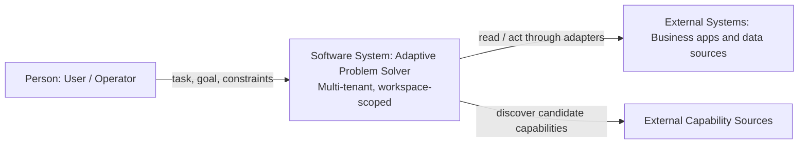
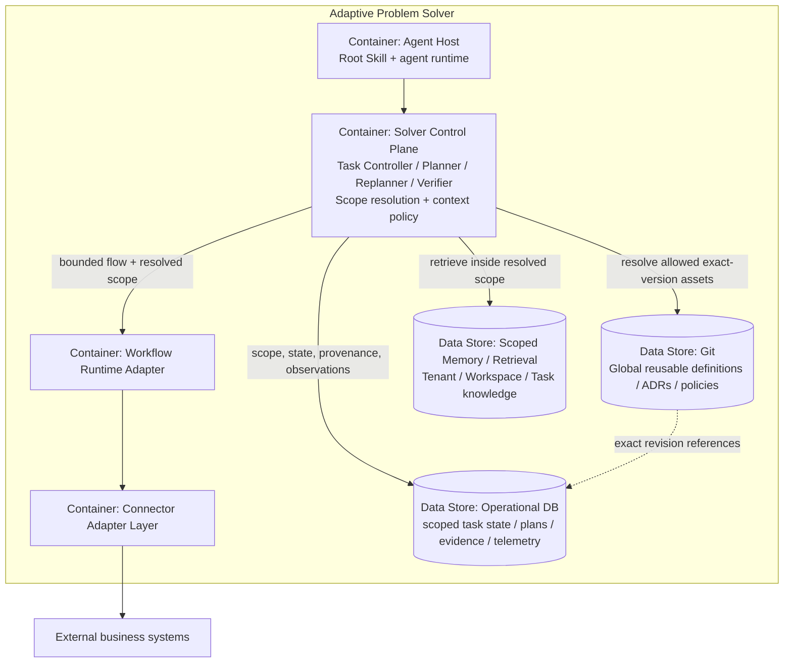
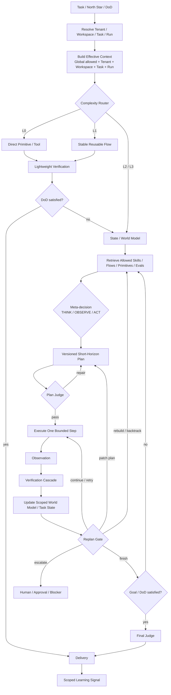
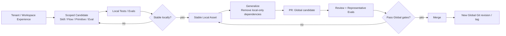
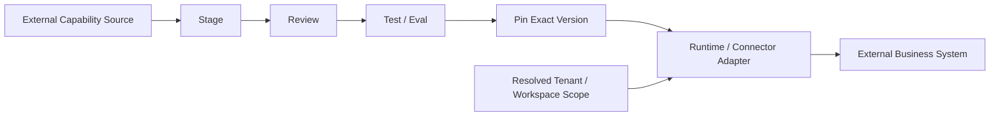
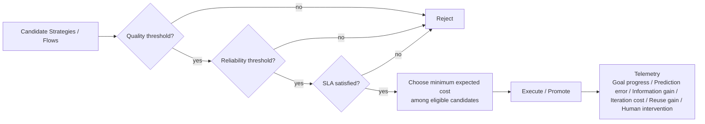
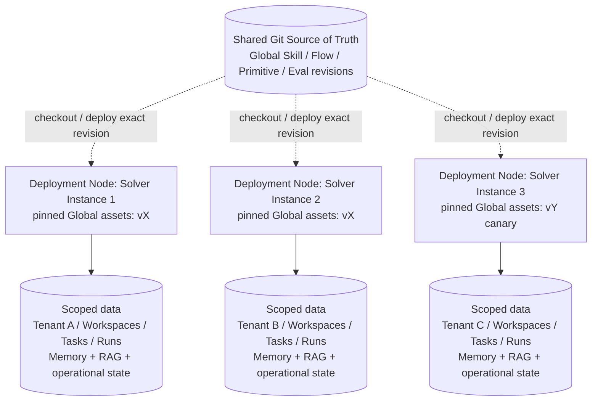

# Adaptive Problem Solver architecture

The general user-facing entry point is `adaptive-problem-solver/SKILL.md`. The agent host acts as the meta-orchestrator. Deterministic policies own critical task-state transitions, plan mutation, verification gates, scope resolution and promotion.

This file is the **canonical architecture view set**. Active ADRs define why each boundary exists. Diagrams are projections of those decisions.

## North Star

**Tenant-specific context stays inside its Tenant boundary, while multiple Solver Instances can reuse the same reviewed Global capabilities and generalized useful experience has a controlled path to become shared system capability.**

Canonical logical scope:

`Global → Tenant → Workspace → Task → Run`

- **Tenant** — hard ownership boundary.
- **Workspace** — hierarchical context boundary; may represent a project, business area, research topic or personal domain.
- **Task** — durable unit of work.
- **Run** — execution attempt or continuation.
- Solver Instance is deployment topology, not a level in this hierarchy.

## C4 view discipline

- **C1 System Context:** solver plus external actors/systems.
- **C2 Container:** actual major runtime and data-store boundaries; do not invent services for logical libraries.
- **Dynamic:** scoped context assembly, planning, execution, verification and replanning.
- **Learning:** local reusable assets and controlled Global promotion.
- **Deployment:** physical mappings of the same logical scope model and versioned Global asset distribution.
- **Policy:** quality/reliability/SLA/cost selection and telemetry.

Tenant and Workspace are domain scopes, not C4 containers. A canonical C3 diagram remains deferred until component boundaries exist in code; ADR-0026/0027 define the target component responsibilities meanwhile.

## View 1 — C4 System Context

Tenant/Workspace boundaries are internal properties of APS, not additional C1 systems.

Primary ADR coverage: **ADR-0017, ADR-0025, ADR-0026, ADR-0027**.

## View 2 — C4 Container View

The **Reusable Asset Layer is a logical library/resolution responsibility, not a separate network service in the MVP**. Global Skills/Flows/Primitives/Evals come from an exact Git revision/tag/bundle and may be checked out or cached with the Solver deployment. Likewise, the Context Builder remains a Control Plane responsibility. Split either only when an independent deployment/scaling need becomes real.

Primary ADR coverage: **ADR-0017, ADR-0019, ADR-0020, ADR-0024, ADR-0025, ADR-0026, ADR-0027**.

## C3 status — contracts before boxes

Expected responsibilities once component boundaries stabilize:

| Responsibility | Contract |
|---|---|
| Scope Resolver | Resolve one Tenant plus applicable Workspace/Task/Run coordinates before retrieval or execution. |
| Workspace Manager | Maintain same-Tenant workspace hierarchy and local configuration. |
| Context Builder | Assemble effective context only from allowed sources and preserve provenance. |
| Inheritance Resolver | Resolve Global → Tenant → Workspace ancestry → local overrides without copying definitions. |
| Policy Evaluator | Enforce mandatory higher-level rules and invalid-scope rejection. |
| Namespace Resolver | Map logical scope to the correct memory/retrieval partition. |
| Memory Retriever/Writer | Read/write durable knowledge within resolved scope. |

When these become stable modules/services, add the canonical C3 diagram and link boxes to implementation paths.

## View 3 — Dynamic Runtime / Replanning View

Scope is resolved before retrieval. Replanning remains continuous after bounded steps without widening that scope.

Primary ADR coverage: **ADR-0018, ADR-0019, ADR-0020, ADR-0021, ADR-0022, ADR-0026, ADR-0027**.

## View 4 — Scoped Asset and Learning Lifecycle

For the MVP, the promotion mechanism is deliberately ordinary Git workflow: **candidate change → PR → review/tests/evals → merge → new Global revision**. No Promotion Service is required. Local stability and Global visibility remain separate decisions, and raw scoped memory has no direct Global promotion path.

Primary ADR coverage: **ADR-0020, ADR-0021, ADR-0023, ADR-0024, ADR-0026, ADR-0027**.

## View 5 — External Capability Boundary

Primary ADR coverage: **ADR-0024, ADR-0025, ADR-0026, ADR-0027**.

## View 6 — Strategy Selection and Telemetry Policy

Primary ADR coverage: **ADR-0021, ADR-0022, ADR-0023**.

## View 7 — C4 Deployment View

The Git arrows represent **versioned distribution, not synchronous runtime registry calls**. Sharing the same Global Flow/Skill/Primitive/Eval revision does not create a path between Tenant data stores. Instance placement/version selection may initially be ordinary deployment configuration or environment variables; no Fleet Manager or Deployment Registry service is required.

The same logical Tenant/Workspace/Task/Run contracts also support a shared multi-tenant instance or a fully isolated tenant stack later. A runtime instance remains infrastructure, not a hierarchy level.

Primary ADR coverage: **ADR-0020, ADR-0024, ADR-0026, ADR-0028**.

## ADR → Architecture View Traceability

| ADR | Context | Container | Dynamic | Learning | External | Policy | Deployment |
|---|---:|---:|---:|---:|---:|---:|---:|
| 0017 Root Skill + Coding Agent | ✅ | ✅ |  |  |  |  |  |
| 0018 Lifecycle + Complexity Routing |  |  | ✅ |  |  |  |  |
| 0019 Deterministic Planning + Replanning |  | ✅ | ✅ |  |  |  |  |
| 0020 Reusable Asset Model + Retrieval |  | ✅ | ✅ | ✅ |  |  | ✅ |
| 0021 Verification / Eval / Promotion |  |  | ✅ | ✅ |  | ✅ |  |
| 0022 Quality → Reliability → SLA → Cost |  |  | ✅ |  |  | ✅ |  |
| 0023 Learning + Controlled Self-Modification |  |  |  | ✅ |  | ✅ |  |
| 0024 Persistence + Provenance |  | ✅ |  | ✅ | ✅ |  | ✅ |
| 0025 Runtime + Connector Boundary | ✅ | ✅ |  |  | ✅ |  |  |
| 0026 Scope Hierarchy + Tenant Isolation | ✅ | ✅ | ✅ | ✅ | ✅ |  | ✅ |
| 0027 Context Assembly + Memory Scoping | ✅ | ✅ | ✅ | ✅ | ✅ |  |  |
| 0028 Runtime Topology |  |  |  |  |  |  | ✅ |

## Architecture consistency rule

When an Accepted/Experimental ADR changes:

1. update all affected canonical views in the same change;
2. update the traceability matrix;
3. if no diagram should change, mark the ADR as policy-only and explain why;
4. do not add a diagram merely to duplicate ADR prose.

ADR-0001…ADR-0016 remain historical records superseded by the active ADR set.
