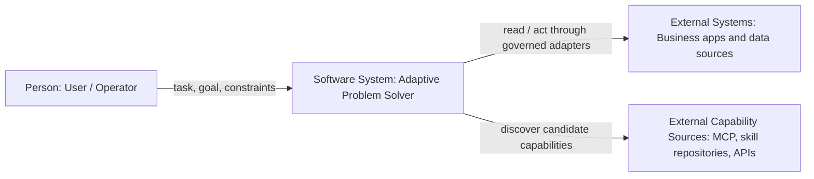
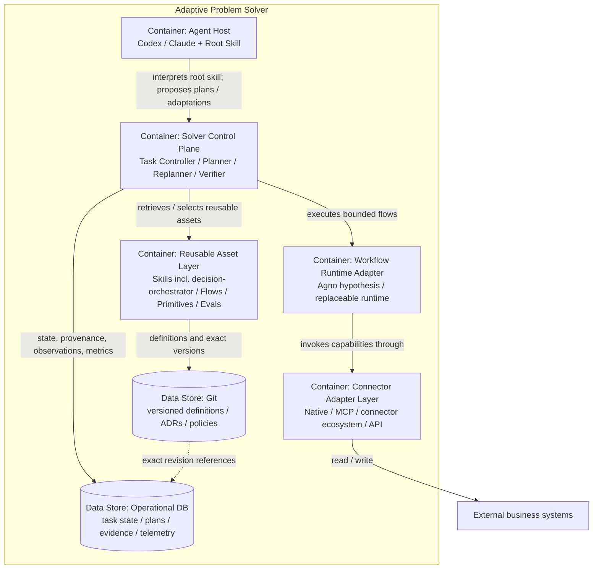
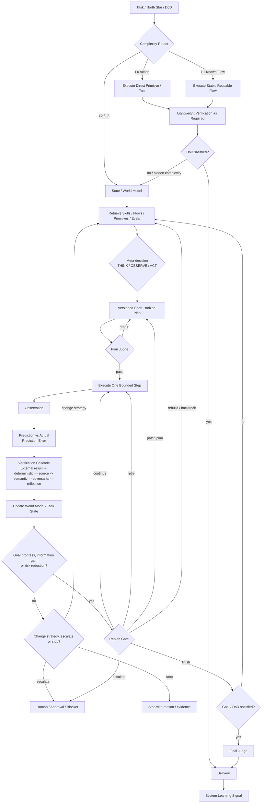
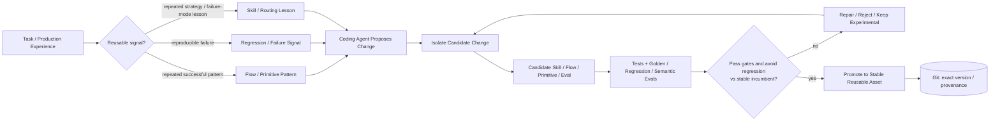
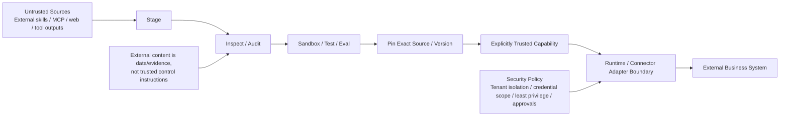
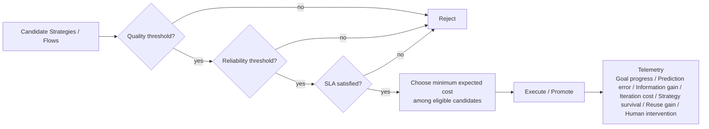

# Adaptive Problem Solver architecture

The general user-facing entry point is `adaptive-problem-solver/SKILL.md`. Codex/Claude Code acts as the meta-orchestrator. Deterministic code/policies own critical task-state transitions, plan mutation, verification gates and promotion. `decision-orchestrator` is a specialist subsystem for formal decision analysis.

This file is the **canonical architecture view set**. Active ADRs define why each boundary exists. Mermaid diagrams are projections of those decisions; they do not replace the ADR text.

## C4 view discipline

We use C4 principles plus supplementary dynamic/policy views:

- **System Context** shows the solver as one software system and its external actors/systems.
- **Container** shows the major runtime/data-store boundaries inside the solver.
- **Dynamic** shows how one task moves through planning, execution, verification and replanning.
- **Asset/Learning** shows the lifecycle of reusable capabilities and controlled self-modification.
- **Trust/Deployment** shows external capability acquisition, connector boundaries and security controls.
- **Selection Policy** is a supplementary non-C4 policy view for quality/reliability/SLA/cost and telemetry.

Do not mix implementation-level classes/functions into Context or Container views. Do not encode rationale in diagrams; rationale remains in ADRs. A Component view is intentionally deferred until the control-plane implementation is stable enough that component boundaries are real rather than speculative.

## View 1 — C4 System Context

Primary ADR coverage: **ADR-0017, ADR-0025**.

## View 2 — C4 Container View

Primary ADR coverage: **ADR-0017, ADR-0019, ADR-0020, ADR-0024, ADR-0025**.

## View 3 — Dynamic Runtime / Replanning View

Primary ADR coverage: **ADR-0018, ADR-0019, ADR-0020, ADR-0021, ADR-0022**.

## View 4 — Reusable Asset and Learning Lifecycle

Primary ADR coverage: **ADR-0020, ADR-0021, ADR-0023, ADR-0024**.

## View 5 — Trust / Deployment Boundary

Primary ADR coverage: **ADR-0024, ADR-0025**.

## View 6 — Strategy Selection and Solver Telemetry Policy

This is a supplementary architecture policy view, not a C4 structural level.

Primary ADR coverage: **ADR-0021, ADR-0022, ADR-0023**.

## ADR → Architecture View Traceability

Every active ADR must either be visible in at least one canonical Mermaid view or be explicitly marked as a non-visual policy. At present, all active ADRs have a visual projection.

| ADR | Context | Container | Dynamic | Learning | Trust | Policy | Coverage |
|---|---:|---:|---:|---:|---:|---:|---|
| **0017 Root Skill + Coding Agent** | ✅ | ✅ |  |  |  |  | Covered |
| **0018 Lifecycle + Complexity Routing** |  |  | ✅ |  |  |  | Covered |
| **0019 Deterministic Planning + Replanning** |  | ✅ | ✅ |  |  |  | Covered |
| **0020 Reusable Asset Model + Retrieval** |  | ✅ | ✅ | ✅ |  |  | Covered |
| **0021 Verification / Eval / Promotion** |  |  | ✅ | ✅ |  | ✅ | Covered |
| **0022 Quality → Reliability → SLA → Cost + Telemetry** |  |  | ✅ |  |  | ✅ | Covered |
| **0023 Learning + Controlled Self-Modification** |  |  |  | ✅ |  | ✅ | Covered |
| **0024 Persistence + Provenance** |  | ✅ |  | ✅ | ✅ |  | Covered |
| **0025 Runtime + Connector Boundary** | ✅ | ✅ |  |  | ✅ |  | Covered |

## Architecture consistency rule

When an Accepted/Experimental ADR changes:

1. identify which canonical view(s) it affects;
2. update those Mermaid views in the same architecture change;
3. update this traceability matrix;
4. if no diagram should change, explicitly state that the ADR is policy-only and why;
5. do not create a new diagram merely to duplicate ADR prose.

ADR-0001…ADR-0016 are historical records superseded by the active ADR set.
